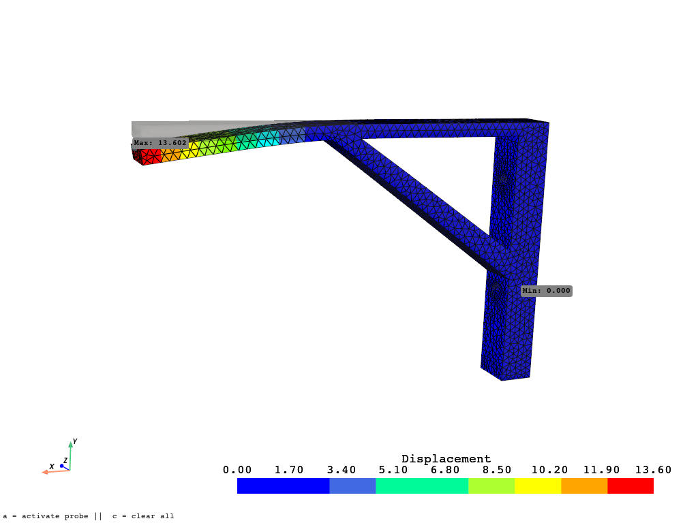

# visulize ansys_rst_file, ccx_frd_file

A small Python project to load and visualize results from ANSYS `.rst` files (simulation result files).

This tool uses [PyVista](https://github.com/pyvista/pyvista) and [ansys-mapdl-reader](https://github.com/pyansys/ansys-mapdl-reader) to extract and plot stress, displacement, or other FEA results from ANSYS simulations.

---

## Features
- Loads result files
- Plots nodal displacements, von Mises stress
- Press `a` to activate interactive probe mode (click on mesh to get values)
- Press `s` to clear all probe markers

---
## Results

- Total deformation
- Von Mises stress

(Feel free to explore your own results: [PyAnsys DPF Example](https://mapdl.docs.pyansys.com/version/stable/examples/gallery_examples/00-mapdl-examples/basic_dpf_example.html))
<p align="center">
  
  <br>
  <em>Figure: Deformed mesh with von Mises stress and probe markers</em>
</p>

---
## Installation
Clone this repository and install dependencies:

```bash
git clone https://github.com/yourusername/visulize_ansys_rst_result.git
cd visulize_ansys_rst_result
pip install -r requirements.txt

